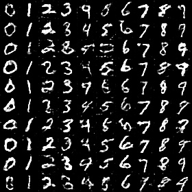
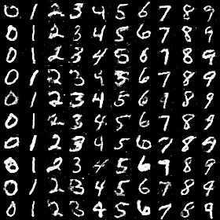
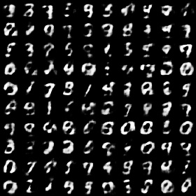

# mxnet-wgan

mxnet implement for Conditional Wasserstein GAN

## usage

You only need to change the `is_wgan` flag to test wgan or dcgan results. change `is_mlp` to test mlp result. 

## results

generate result after 30 epochs.

**wgan**:

**dcgan**:

**mlp wgan**:

note:

* because we want to try mlp result, so I flatten the input image to a vector, then append condition one-hot vector to the vector. If you only want to try Convolution ops, you will not need to add condition in this way
* wgan seems not better than dcgan, maybe something wrong. If you know what happen, please let me know.
* you can learn a lot about how to construct data iterator, how to backward without output layer

## Acknowledgments

Code borrows from [mxnet gan example](https://github.com/dmlc/mxnet/blob/master/example/gan/dcgan.py),  wgan metric from [WGAN](https://github.com/luoyetx/WGAN)
